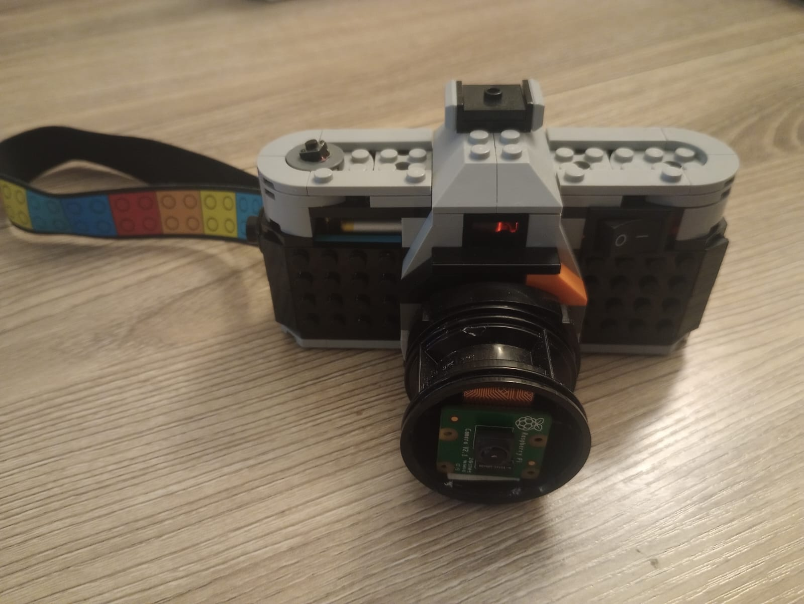
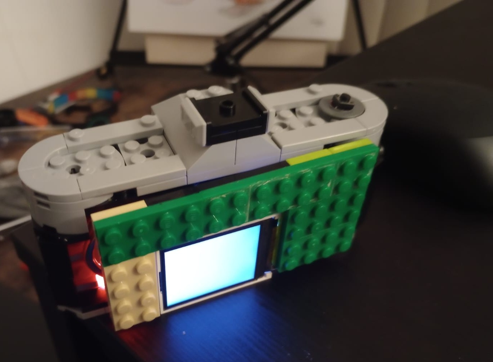

# Raspberry Pi LCD Camera System V1.

This project implements a button-activated camera system using a Raspberry Pi, the Picamera2 library, and a 1.8-inch SPI LCD display. It captures high-resolution still images, previews them on the screen, and saves them with timestamped filenames. Ideal for DIY photography projects, Raspberry Pi learning, or creative automation setups.

## Features

- Captures high-resolution photos (2000x1500)
- Displays live status and captured image on a 1.8-inch LCD
- Takes a photo on physical button press (GPIO)
- Saves images with timestamped filenames
- Uses Picamera2 for advanced camera control

## Hardware Required

- Raspberry Pi (any model with camera support) in this case Zero W
- Raspberry Pi Camera Module (compatible with Picamera2)
- 1.8-inch SPI LCD display (e.g., ST7735-based)
- Tactile push button (connected to GPIO 26)
- Optional: 3D-printed camera housing or mount

## Libraries Used

- [picamera2](https://github.com/raspberrypi/picamera2)
- Pillow (Python Imaging Library)
- gpiozero (for button input)
- spidev (for SPI communication)
- Custom display driver: `LCD_1inch8`

## Wiring Overview

| Component           | GPIO Pin |
|--------------------|----------|
| LCD RST            | GPIO 27  |
| LCD DC             | GPIO 25  |
| LCD BL (Backlight) | GPIO 18  |
| Button             | GPIO 26  |

Make sure to also connect the SPI pins (MOSI, SCLK, CS) according to your display's specification.

## How It Works

1. On boot, the script initializes the LCD and camera.
2. Displays a "Waiting" message until the button is pressed.
3. When pressed:
    - A photo is captured.
    - The image is resized and shown on the LCD.
    - The image is saved to the `DCMI/` folder on the desktop with a timestamp.

## Running the Code

1. Enable SPI and the camera on your Raspberry Pi via `raspi-config`.
2. Install the required libraries:

    ```bash
    sudo apt update
    sudo apt install python3-picamera2 python3-pil python3-gpiozero python3-spidev
    ```

3. Clone this repository and run the script:

    ```bash
    python3 camera_lcd.py
    ```

## Running as a Service (Optional)

You can run the camera system automatically on boot using `systemd`. Here's an example unit file:

### 1. Create a service file

Create a file at `/etc/systemd/system/capture.service` with the following content:

```ini
[Unit]
Description=Capture service
After=graphical.target

[Service]
Type=simple
WorkingDirectory=/home/andres/Desktop/camera_lego
ExecStart=/usr/bin/python3 /home/andres/Desktop/camera_lego/lcd_v4.py
StandardOutput=append:/home/andres/info.log
StandardError=append:/home/andres/error.log
Environment=DISPLAY=:0
Environment=XAUTHORITY=/home/andres/.Xauthority
Restart=always
RestartSec=1

[Install]
WantedBy=default.target
Alias=capture.service

```

## Folder Structure
- Camera_lcd.py # Main script
- lib/ # Custom LCD driver
- Font/Font00.ttf # Display font
- DCMI/ # Saved images (auto-created)


## Notes

- Make sure the folder `/home/andres/Desktop/camera_lego/DCMI/` exists or modify the path in the script.
- Adjust image resolution or LCD settings based on your hardware.

## Lego Camera




## License

The software of the camera is licensed under the GPLv3.

